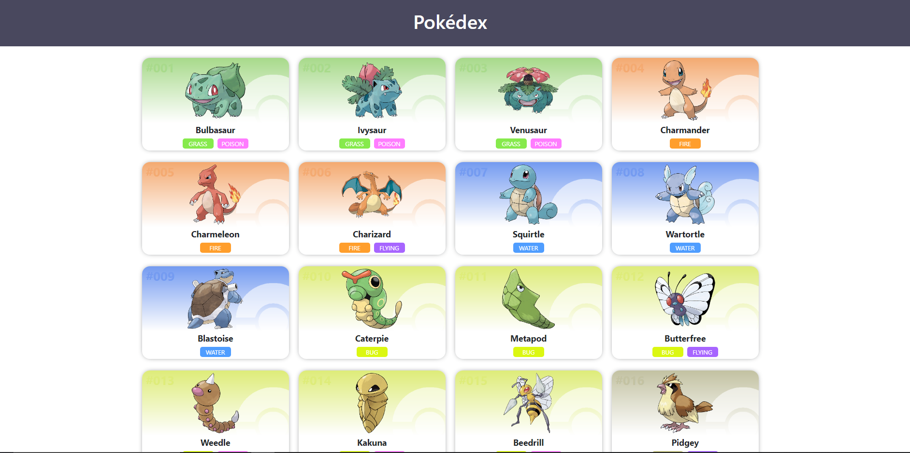

## Pokédex

Se você quiser ver o projeto funcionando [CLIQUE AQUI](https://pokedex-caio.herokuapp.com/).

## Sobre o projeto

Essa é uma Pokédex, onde você pode obter informações de todos os Pokémon. 

O propósito de ter feito este projeto foi: aprender mais ReactJs na prática, react hooks, consumo de API e mais.

Ele faz parte do meu portifólio, fique à vontade para fornecer qualquer feedback que possa contribuir com o projeto, código, estrutura ou algo que possa me tornar um desenvolvedor melhor!😉

Conecte-se comigo no [LinkedIn](https://www.linkedin.com/in/caio-faraleski/).

## Funcionalidades

- Página inicial
    - Lista todos os Pokémon.

- Cards
    - Quando clicado vão para as infomações do respectivo Pokémon.

## Construído com 

- Html
- Css
- JavaScript
- Sass
- Bootstrap
- ReactJs
- TypeScript